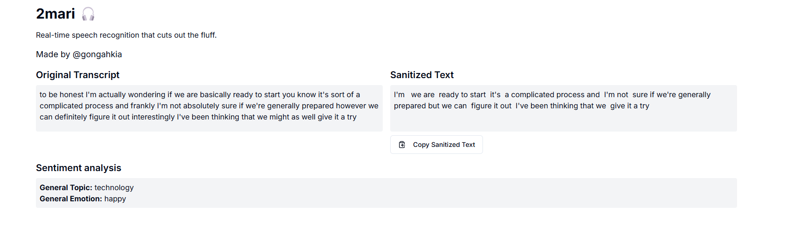

[](https://github.com/gongahkia/2mari/releases/tag/1.0.0) 

# `2mari` 🎧

<del>Kind of</del> janky [text-to-speech](https://dictionary.cambridge.org/dictionary/english/text-to-speech) that <del>basically</del> respects your time by translating [yappanese](https://www.urbandictionary.com/define.php?term=yappanese) back to english.

Made with React, Tailwind CSS and Next.Js.

Here's [why](#why).



## Usage

Build `2mari` locally.

```console
$ git clone https://github.com/gongahkia/2mari
$ cd src/2mari
$ npm install word2vec-node
$ npm install next@latest react@latest react-dom@latest
$ npx shadcn@latest add button 
$ npm run dev
```

## Support

`2mari` is currently supported on the following browsers.

| Browser | Status | 
| :--- | :--- | 
| [Google Chrome](https://www.google.com/intl/en_sg/chrome/) |  | 
| [Microsoft Edge](https://www.microsoft.com/en-us/edge?ep=0&form=MA13T3&es=176&cs=578062562) |  | 
| [Safari](https://www.apple.com/sg/safari/) *(Version 14 onwards)* |  | 
| [Firefox](https://www.mozilla.org/en-US/firefox/new/) *(Version 49 onwards)* |  | 
| [Internet Explorer](https://support.microsoft.com/en-us/windows/internet-explorer-downloads-d49e1f0d-571c-9a7b-d97e-be248806ca70) |  | 

> [!IMPORTANT]  
> Support for niche browsers like Opera, Vivaldi have not been extensively tested. [Open an issue](https://github.com/gongahkia/skill-hunter/issues) for further support.  

## Architecture

```mermaid

```

## Why?

I previously built a similar project called [`Keep talking bro`](https://github.com/gongahkia/the-sandbox/tree/main/javascript/keepTalkingBro) in 2023 that added filler words to provided text.   

Since then *(and having entered University)*, I wondered if it would be possible to achieve the opposite, a TTS service that simplified verbose text.

## Reference

The name `2mari` is in reference to the Japanese expression つまり (tsumari), which roughly translates to "in other words" in English. 

